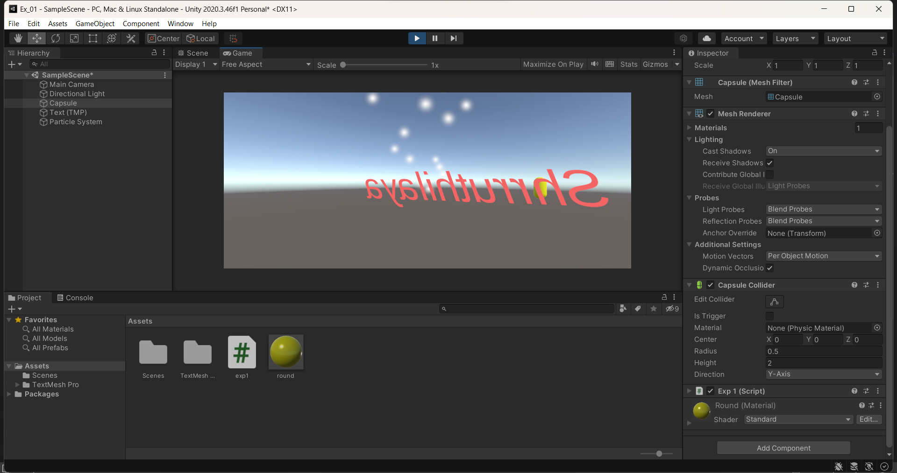
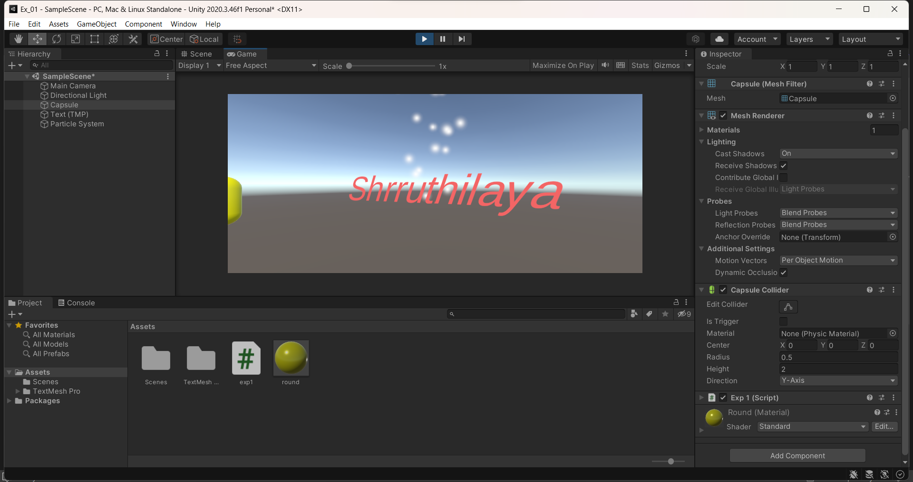

# ROTATING-THE-GAMING-OBJECT

## AIM:
To develop a 3D application for rotating the gaming objects in unity.
## ALGORITHM:
### Step1:
Start.
### Step2:
Click File -> Scene -> Select the scene -> Save as-> New folder(Scenes)-> File name (Expno1).
### Step3:
Click Hierarchy -> 3DObject -> Cylinder
Hierarchy -> 3DObject -> Capsule
Hierarchy -> 3DObject -> Text
Hierarchy -> Effects -> Particle system.
### Step4:
Create a folder in project and name as Materials
Material folder -> Create -> Material (Name: Cylinder)
Inspector ->Surface Inputs ->BaseMAp (Choose the color)
Drag the Cylinder to the plane and release the mouse.

Create a folder in project and name as Materials
Material folder -> Create -> Material (Name: Capsule)
Inspector ->Surface Inputs ->BaseMAp (Choose the color)
Drag the Capsule to the plane and release the mouse.

### Step5:
Click Hierarchy -> DirectionalLight
Inspector -> Change the color to white (255,255,255).

### Step6:
Create a folder name Coding and create a C# file to add the coding in it.

### Step7:
To add our C# Script file to our selected object, click on the C# Script file and drag it to our selected objects in the Hierarchy window nad run the application.

### Step8:
Stop.

## PROGRAM:
Program developed by : Shrruthilaya G

Register number : 212221230097
```
using System.Collections;
using System.Collections.Generic;
using System.Collections.Specialized;
using System.Threading;
using UnityEngine;

public class NewBehaviourScript : MonoBehaviour
{
    // Start is called before the first frame update
    void Start()
    {
        
    }

    // Update is called once per frame
    void Update()
    {
        transform.RotateAround(Vector3.right, Vector3.up, 40 * Time.deltaTime);
    }
}
```
## OUTPUT:


## RESULT:
Thus, the 3D application for rotating the gaming objects in unity is developed successfully.